<p align="center">
  
</p>

<p align="center">
  <strong>See your cluster's wasted dollars in 20 seconds — no Prometheus required.</strong>
</p>

`kubetidy` is a Kubernetes-native CLI that scores your cluster's efficiency, quantifies
wasted spend in **real dollars**, and gives you evidence-backed, **action-ready** rightsizing
recommendations — and tells you *why*.

It is read-only and safe to run anywhere. Install its tiny in-cluster operator and you get
Prometheus-grade recommendations with **no Prometheus** at all.

<p align="center">
  
</p>

---

## Why kubetidy?

Most clusters run at **~10% CPU / ~20% memory utilization** — you are paying for capacity
your workloads never use. Plenty of tools *find* that waste; the hard part is **trusting**
and **acting on** the recommendations. kubetidy is built around trust:

- **Works on any cluster.** Install the operator for high-confidence history, or point it at
  Prometheus — no hard dependency to get a first answer.
- **Dollars, not millicores.** A single, shareable **Cluster Efficiency Score** and a
  monthly dollar figure.
- **Every number shows its work.** `--explain` reveals the exact query, window, sample
  count, variance, and policy behind each recommendation.
- **Read-only and reversible by design.** kubetidy never mutates your cluster. `diff` prints
  the exact, reversible `kubectl patch`; `pr` writes a GitOps change set you review and merge.

## The data ladder

kubetidy auto-detects the best data source available and stamps every finding with the tier
that proved it. It never fails hard — it degrades to whatever is present.

| Tier | Needs | You get | Confidence |
|------|-------|---------|------------|
| 0 | K8s API + **kubetidy operator** | historical P50/P95/max with **no Prometheus** | high |
| — | K8s API + metrics-server only | single live snapshot (fallback, conservative) | low |
| 1 | + Prometheus | historical P50/P95/max over a window | high |
| 2 | + OpenCost *(coming)* | precise allocated cost | high |

kubetidy prefers, in order: **Prometheus (Tier 1)** → **kubetidy operator (Tier 0)** → bare
metrics-server snapshot (a conservative fallback). All are auto-detected; no flags required.

## Install

> Packaging via **krew** (`kubectl krew install tidy`), **Homebrew**, and `curl | sh` is on
> the [roadmap](ROADMAP.md). For now, build from source.

Requires **Go 1.26+**.

```sh
git clone https://github.com/mayur-tolexo/kubetidy.git
cd kubetidy
make build          # produces ./bin/kubetidy and ./bin/kubectl-tidy
```

Put the binaries on your `PATH`. As soon as `kubectl-tidy` is on `PATH`, the kubectl plugin
form works:

```sh
sudo cp ./bin/kubetidy ./bin/kubectl-tidy /usr/local/bin/
kubectl tidy scan
```

kubetidy inherits your current kubeconfig context and namespace, exactly like any other
kubectl plugin.

## One-command setup: `kubectl tidy init`

kubetidy installs its in-cluster components (the `UsageProfile` CRD and the operator) from
manifests **embedded in the binary** — no hunting for YAML, no `kubectl apply -f`:

```sh
kubectl tidy init                 # install the CRD + operator (server-side apply)
kubectl tidy init --crd-only      # just the CRD (e.g. GitOps manages the Deployment)
kubectl tidy init --print         # print the manifests instead of applying them
kubectl tidy init --image REPO/kubetidy-operator:TAG   # pin a custom operator image
```

`init` applies the CRD first, waits for it to become Established, then deploys the operator.
It is idempotent — re-run it any time to converge the cluster to the embedded manifests.

To remove everything `init` created, use its inverse:

```sh
kubectl tidy uninstall              # delete the operator + all CRDs (and recorded data); prompts first
kubectl tidy uninstall --dry-run    # list exactly what would be removed; deletes nothing
kubectl tidy uninstall --yes        # skip the confirmation prompt
kubectl tidy uninstall --keep-crds  # remove only the operator; keep the CRDs and history
kubectl tidy cleanup                # alias for uninstall
```

`uninstall` (alias `cleanup`) deletes the operator first (so it stops writing), then the CRDs
— which cascades to every recorded `UsageProfile`, `ClusterUsageSummary`, and
`Recommendation`. Use `--dry-run` to preview the exact objects (each marked present/absent)
without touching the cluster. It is idempotent: already-absent objects are skipped.

The operator runs from the published image `docker.io/mayurdas1991/kubetidy-operator:latest` —
a **multi-arch Linux image** (`linux/amd64` + `linux/arm64`) that runs in kind and in any
Kubernetes cluster. Maintainers publish it with `make operator-push` (after `docker login`;
requires Docker buildx). Pass `--image` to `init` to use a fork or a pinned version tag
instead.

## High-confidence scans without Prometheus — the operator (Tier 0)

A single `metrics-server` snapshot can't see peaks, so kubetidy is deliberately conservative
with it. The **kubetidy operator** fixes this *without* Prometheus: a tiny, read-only
in-cluster controller that continuously samples metrics-server, accumulates per-container usage
into decaying histograms (the technique the Vertical Pod Autoscaler uses), and stores the
result in `UsageProfile` custom resources. `scan` auto-detects it — Prometheus-grade
recommendations, zero external dependencies.

It is strictly read-only with respect to workloads: it observes and records, and **never evicts
or resizes anything** (that is what makes VPA risky; kubetidy does not do it).

```sh
kubectl tidy init               # installs CRD + operator
kubectl get usageprofiles -A    # inspect the recorded history
# give it a few minutes to accumulate, then:
kubectl tidy scan               # now runs at "data: 0 (kubetidy operator)"
```

For local kind testing the Makefile wraps the image build + deploy:

```sh
make operator-deploy
```

See [docs/design/operator.md](docs/design/operator.md) for the design.

## High-confidence scans with Prometheus (Tier 1)

Already run Prometheus? kubetidy auto-detects the common in-cluster service names, so plain
`kubectl tidy scan` upgrades to Tier 1 automatically. Or point it explicitly:

```sh
kubectl tidy scan --prometheus-url http://prometheus.monitoring.svc:9090
```

No Prometheus and want it for local testing? Deploy a minimal one and re-scan:

```sh
make prometheus       # deploy a tiny Prometheus (namespace: monitoring)
make demo-scan-prom   # scan the demo namespace at Tier 1
```

## Try it in 2 minutes (local kind cluster)

No real cluster handy? Spin up a throwaway [kind](https://kind.sigs.k8s.io/) cluster with
deliberately over-provisioned demo workloads and watch kubetidy flag the waste:

```sh
make e2e          # kind up → metrics-server → deploy demo → scan + diff
make e2e-prom     # same, plus Prometheus for a Tier-1 scan
make kind-down    # tear it all down
```

> Requires `kind` and `kubectl` on your PATH. The demo workloads use the `pause` image, so
> they request multiple cores/GiB while using almost nothing — exactly the waste kubetidy is
> built to surface.

## Make commands

Run `make help` to see everything. The common ones:

| Target | What it does |
|--------|--------------|
| `make build` | Build the binary as both `kubetidy` and `kubectl-tidy` into `./bin` |
| `make build-operator` | Build the kubetidy operator binary into `./bin` |
| `make install` | Build and copy both faces to `/usr/local/bin` |
| `make test` / `make test-race` | Run unit tests (optionally with the race detector) |
| `make cover` | Tests + total coverage; `make cover-html` for a browsable report |
| `make lint` | Run golangci-lint (installs it if missing) |
| `make check` | Full pre-PR gate: tests + vet + gofmt + lint |
| `make e2e` / `make e2e-prom` | Full local demo (with / without Prometheus) |
| `make operator-deploy` | Build + deploy the kubetidy operator (Tier 0, no Prometheus) |
| `make prometheus` | Deploy a minimal Prometheus (unlocks Tier 1) |
| `make kind-up` / `make kind-down` | Create / delete the kind cluster |
| `make clean` | Remove build and coverage output |

## Usage

kubetidy ships as a single binary with two faces — use whichever you prefer:

- `kubectl tidy <command>` (kubectl plugin form)
- `kubetidy <command>` (standalone)

Commands: **`scan`** (report), **`diff`** (reversible `kubectl patch` per recommendation),
**`pr`** (a GitOps change set — patch files + a Markdown PR body), **`init`** (install the
CRD + operator), and `version`.

### `scan` — score, dollars, and recommendations

```sh
kubectl tidy scan                       # scan current context, all namespaces
kubectl tidy scan -n payments           # scope to one namespace
kubectl tidy scan --output json         # machine-readable, stable schema
kubectl tidy scan --explain checkout    # full derivation for one workload
kubectl tidy scan --prometheus-url URL  # force Tier 1 (Prometheus)
kubectl tidy scan --top 10              # limit recommendations shown
```

### `diff` — the exact, reversible patch

`diff` prints, for each recommendation, the precise `kubectl patch` command that would apply
it, with the monthly saving. It is **read-only** — kubetidy never runs the patch.

```sh
kubectl tidy diff                       # patches for every recommendation
kubectl tidy diff --explain checkout    # just the patch for one workload
```

### `pr` — a reviewable GitOps change set

`pr` turns the scan into something you can merge: one strategic-merge patch file per
recommendation, plus a Markdown PR body that leads with the monthly savings, a per-workload
table with evidence, and apply/revert instructions. kubetidy never commits, pushes, or
applies — you review and open the PR yourself (Argo CD / Flux or `kubectl` apply it).

```sh
kubectl tidy pr                      # write ./kubetidy-patches/ + print the PR body
kubectl tidy pr --out ./patches      # choose the output directory
kubectl tidy pr --body-out PR.md     # write the PR body to a file
kubectl tidy pr --include-grow       # also include under-provisioned ("grow") workloads
```

### Common flags

| Flag | Applies to | Description |
|------|-----------|-------------|
| `-n, --namespace` | scan, diff, pr | Namespace to scan (default: all) |
| `--context` | all | kubeconfig context to use |
| `--prometheus-url` | scan, diff, pr | Prometheus base URL (forces Tier 1) |
| `--window` | scan, diff, pr | Prometheus lookback window (default `14d`) |
| `--explain` | scan, diff | Focus on a single workload |
| `--top` | scan, diff, pr | Max recommendations to show/include |
| `--cpu-cost` / `--mem-cost` | scan, diff, pr | Override $/core-month and $/GiB-month |
| `-o, --output` | scan | `table` (default) or `json` |

## Rightsizing policy (defaults)

- **CPU request** = P95 + 15% headroom; **no CPU limit** by default (avoids throttling).
- **Memory request** = max + 15% headroom (memory OOMs, so we use max, not a percentile);
  **memory limit** = request (Guaranteed QoS).
- **Snapshot safety**: when only a single metrics-server snapshot is available, an extra
  buffer and request floors keep recommendations conservative.

All defaults are surfaced in `--explain` and overridable. The number is never a black box.

## Status

🚧 **Active development.** `scan`, `diff`, `pr`, and `init` work today, with a read-only
operator (Tier 0) and Prometheus auto-detection. See the [roadmap](ROADMAP.md) for what is
next (guarded apply, OpenCost cost, multi-cluster), and
[docs/ARCHITECTURE.md](docs/ARCHITECTURE.md) for the high-level design and flow diagrams.

## Contributing

kubetidy is open stack, Kubernetes-native, and built for contribution. Start with
[good first issues](https://github.com/mayur-tolexo/kubetidy/labels/good%20first%20issue),
read [CONTRIBUTING.md](CONTRIBUTING.md), and skim
[docs/ARCHITECTURE.md](docs/ARCHITECTURE.md) for the package layout. The pure-logic packages
(`rightsizer`, `costmodel`, `score`, `patch`, `histogram`) are the easiest, highest-value
place to start.

## License

[Apache-2.0](LICENSE).
