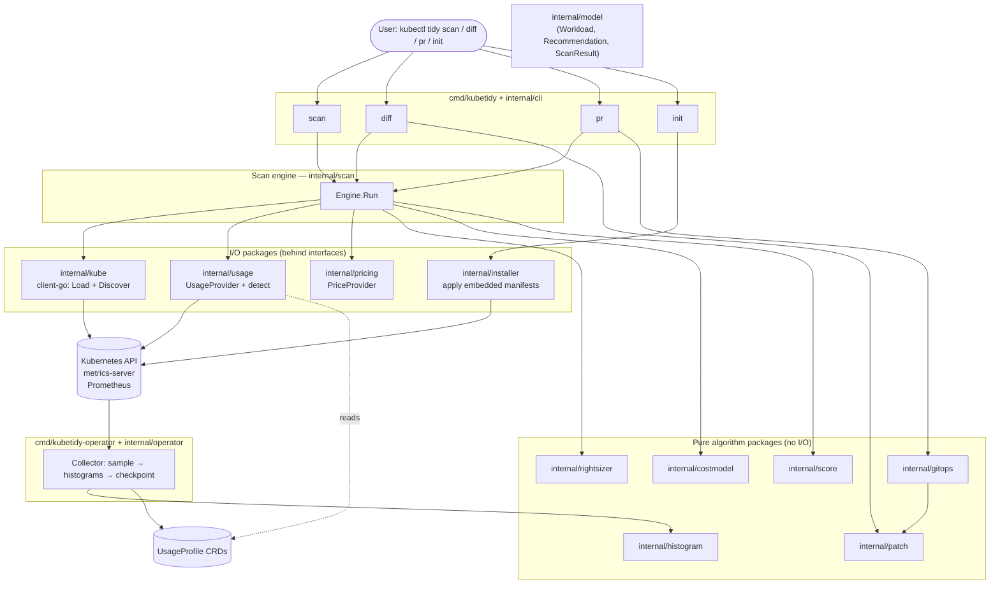
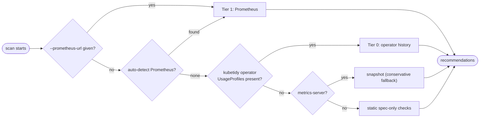
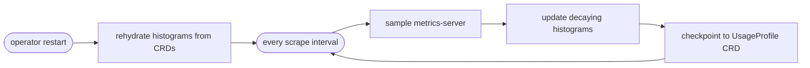

# kubetidy Architecture

This document gives a high-level design (HLD) of kubetidy and the runtime flow of a scan. It
is meant to get a new contributor productive quickly. For the product rationale and roadmap,
see [ROADMAP.md](../ROADMAP.md).

## Design goals

1. **Read-only and reversible by default.** kubetidy never mutates the cluster. `diff` only
   *prints* the `kubectl patch` you would run, `pr` only *writes files* for you to review and
   merge, and the operator only *observes and records* — it never evicts or resizes.
2. **Never fail hard.** A missing data source degrades the result; it does not abort the scan.
3. **Every number shows its work.** Confidence and evidence are derived and reproducible.
4. **Action-ready core.** The `Recommendation` type carries the patch that *would* be applied,
   so action features (GitOps PRs, guarded apply) are new consumers, not rewrites.
5. **Bounded, testable packages.** Pure algorithm packages have no I/O and are table-tested;
   I/O packages sit behind interfaces and are tested with fakes.

## High-Level Design (HLD)

The dependency rule is one-directional: everything depends on `internal/model`; nothing in
`model` depends on anything else. Pure packages never import I/O packages.

## The data ladder (tier selection)

`internal/usage` auto-selects the best source via `DetectPrometheus` and `DetectOperator`:

Cost is a separate axis from usage, behind the `pricing.Provider` interface. By default kubetidy
derives prices from blended cloud rates (`pricing.NewConfigProvider`). When an in-cluster
**OpenCost** is detected (`pricing.DetectOpenCost`) — or pointed at via `--opencost-url` — the
`opencostProvider` queries its allocation API and serves precise per-workload allocated cost
(Tier 2). OpenCost needs Prometheus, which is why Tier 2 sits above Tier 1.

## The operator (Tier 0)

The `kubetidy-operator` binary runs `internal/operator`, which on a timer samples
metrics-server, folds each reading into per-container exponentially-decaying histograms
(`internal/histogram`), and checkpoints summaries + encoded histogram state into `UsageProfile`
CRDs (`internal/apis/usageprofile`). On restart it rehydrates from those CRDs. It is strictly
read-only with respect to workloads — it never evicts or resizes. `kubectl tidy init`
(`internal/installer`) applies the embedded CRD + operator manifests so setup is a single CLI
command. See [design/operator.md](design/operator.md).

## Packages at a glance

| Package | Kind | Responsibility |
|---------|------|----------------|
| `internal/model` | types | Domain types shared by all packages; no dependencies |
| `internal/kube` | I/O | kubeconfig loading + workload discovery (client-go) |
| `internal/usage` | I/O | `UsageProvider`: operator (Tier 0), Prometheus (Tier 1), snapshot; auto-detect |
| `internal/pricing` | I/O | `PriceProvider`: blended config defaults, instance-type refinement |
| `internal/rightsizer` | pure | usage + policy → recommended resources; confidence model |
| `internal/costmodel` | pure | resource delta + price → $/month |
| `internal/score` | pure | scan result → 0–100 efficiency score + breakdown |
| `internal/patch` | pure | recommendation → strategic-merge patch + `kubectl patch` command |
| `internal/gitops` | pure | scan result → GitOps change set (patch files + Markdown PR body) |
| `internal/histogram` | pure | exponentially-decaying bucketed histogram (operator storage core) |
| `internal/apis/usageprofile` | types | UsageProfile CRD schema + unstructured (un)marshalling |
| `internal/operator` | controller | samples metrics-server → histograms → UsageProfile CRDs (Tier 0) |
| `internal/installer` | I/O | applies the embedded CRD + operator manifests (`kubectl tidy init`) |
| `internal/scan` | orchestrator | wires providers + pure packages into a `ScanResult` |
| `internal/report` | output | Table / JSON / `--explain` rendering |
| `internal/cli` | entrypoint | cobra commands (`scan`/`diff`/`pr`/`init`); shared `runEngine` |
| `internal/version` | meta | build/version metadata (ldflags) |

## Extending kubetidy

- **New data source**: implement `UsageProvider` or `PriceProvider` and select it in
  `internal/cli`. Nothing else changes.
- **New output format**: add a renderer in `internal/report` and a `--output` case.
- **New action**: consume the existing `Recommendation` / `internal/patch` / `internal/gitops`
  output — the core stays read-only.
