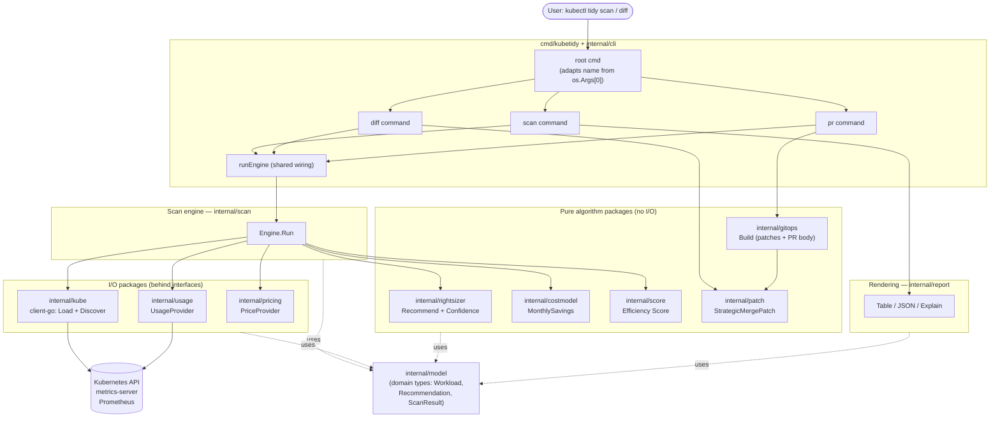
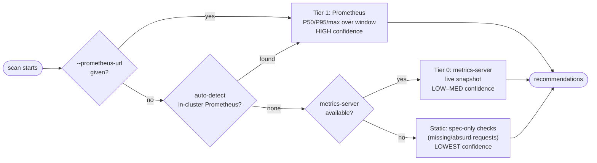
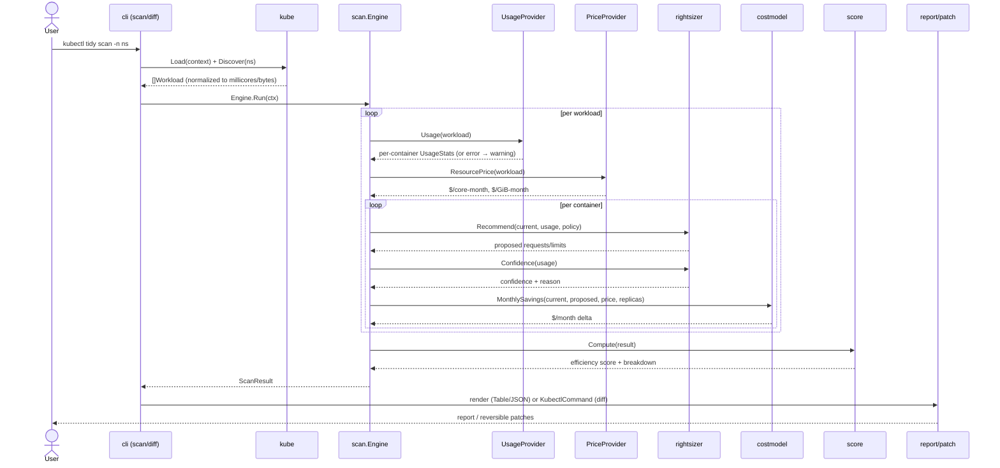

# kubetidy Architecture

This document gives a high-level design (HLD) of kubetidy and the runtime flow of a scan. It
is meant to get a new contributor productive quickly. For the product rationale and roadmap,
see [ROADMAP.md](../ROADMAP.md).

## Design goals

1. **Read-only and reversible by default.** kubetidy never mutates the cluster. `diff` only
   *prints* the `kubectl patch` you would run, and `pr` only *writes files* for you to review
   and merge — kubetidy never commits, pushes, or applies.
2. **Never fail hard.** A missing data source degrades the result; it does not abort the scan.
3. **Every number shows its work.** Confidence and evidence are derived and reproducible.
4. **Action-ready core.** The `Recommendation` type carries the patch that *would* be applied,
   so future action features (GitOps PRs, guarded apply) are new consumers, not rewrites.
5. **Bounded, testable packages.** Pure algorithm packages have no I/O and are table-tested;
   I/O packages sit behind interfaces and are tested with fakes.

## High-Level Design (HLD)

The dependency rule is one-directional: everything depends on `internal/model`; nothing in
`model` depends on anything else. Pure packages never import I/O packages.

## The three-tier data ladder

kubetidy auto-selects the best data source available and stamps every finding with the tier
that proved it.

Tier 2 (OpenCost, for precise allocated cost) is defined behind the `PriceProvider` interface
and deferred — see the roadmap.

## Scan flow (sequence)

## Packages at a glance

| Package | Kind | Responsibility |
|---------|------|----------------|
| `internal/model` | types | Domain types shared by all packages; no dependencies |
| `internal/kube` | I/O | kubeconfig loading + workload discovery (client-go) |
| `internal/usage` | I/O | `UsageProvider`: metrics-server (Tier 0), Prometheus (Tier 1) |
| `internal/pricing` | I/O | `PriceProvider`: blended config defaults, instance-type refinement |
| `internal/rightsizer` | pure | usage + policy → recommended resources; confidence model |
| `internal/costmodel` | pure | resource delta + price → $/month |
| `internal/score` | pure | scan result → 0–100 efficiency score + breakdown |
| `internal/patch` | pure | recommendation → strategic-merge patch + `kubectl patch` command |
| `internal/gitops` | pure | scan result → GitOps change set (patch files + Markdown PR body) |
| `internal/scan` | orchestrator | wires providers + pure packages into a `ScanResult` |
| `internal/report` | output | Table / JSON / `--explain` rendering |
| `internal/cli` | entrypoint | cobra commands (`scan`/`diff`/`pr`); shared `runEngine` with an injectable client-loader seam |
| `internal/version` | meta | build/version metadata (ldflags) |

`internal/usage` also contains `DetectPrometheus`, which probes well-known in-cluster
Prometheus service names so a scan auto-upgrades from Tier 0 to Tier 1 with no configuration.

## Extending kubetidy

- **New data source** (e.g. OpenCost, a managed metrics service): implement `UsageProvider`
  or `PriceProvider` and select it in `internal/cli`. Nothing else changes.
- **New output format**: add a renderer in `internal/report` and a `--output` case.
- **New action** (GitOps PR, guarded apply): consume the existing `Recommendation` /
  `internal/patch` output — the core stays read-only.
